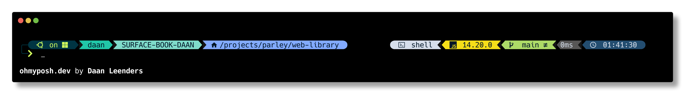

# Personal Oh My Posh theme


A customized version of the night-owl team that ships with oh-my-posh

## Usage
Use the raw url of the `daanleenders.omp.json` file as the value of your config. 
(Full path `https://raw.githubusercontent.com/daanleenders/oh-my-posh-theme/main/daanleenders.omp.json`)
Check the [prompt documentation](https://ohmyposh.dev/docs/installation/prompt) to see how to set up your shell correctly. As an example this is in my `.bashrc` file.
```bash
eval "$(oh-my-posh init bash --config https://raw.githubusercontent.com/daanleenders/oh-my-posh-theme/main/daanleenders.omp.json)"
```
